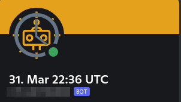

# UTC BOT DISCORD

A simple Discord BOT displaying the current time in UTC.

## View

## Commands:
 - `+time` Prints out the time

## Requirements:

- Docker
- Docker-Compose

## Setup:

1. Get a Discord Bot Token
    1. OAuth2
        1. SCOPES: Bot
        2. BOT PERMISSIONS: Change Nickname, Manage Nicknames

2. Clone repo
3. Copy `docker.compose.yaml.sample` to `docker.compose.yaml`
4. Edit `docker.compose.yaml`
5. Run `docker-compose up -d`

## Development:

- cargo install cargo-chef
- cargo chef prepare --recipe-path recipe.json

### Donations

Solana-Wallet domain: `coffeeplease.sol`